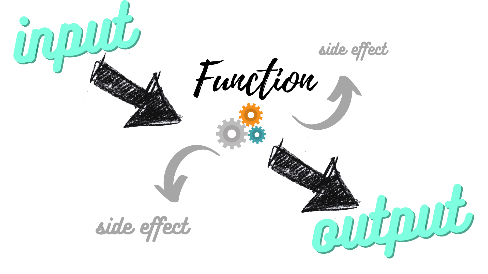

# Python Basics

---
## Basic Data Types
_There are more than these, but these are the types we will handle the most._

- **Numbers**  
	- Integers (Positive and negative whole numbers, including 0) 
		- ```3, 9, 0, -5```   
	- Floats (Decimals BUT they are inexact and should not be used for money).  
		- ```5.9, -0.14, 4.0```

---

- **Strings**
	- Collections of characters. Can be letters, numbers, symbols, or spaces.
		```"Beyoncé", "Chapter 1", "!@#$%!"```  

- **Booleans**
	- Like an on/off switch or a lightbulb. Two options for values, either ```True``` or ```False```  
	- Beyond these two values, there are values that are considered "truthy or falsy" because they can be [represented with a Boolean](https://www.freecodecamp.org/news/truthy-and-falsy-values-in-python/).

- **None Type**
	In Python, when a value does not exist, we use the keyword ```None```. This is different from 0, which is an integer.
---

- Python has **built-in methods** to convert one type to another.
	- ```int()``` converts a string or float to an integer. Note it does NOT round floats. It eliminates everything to the right of the decimal point.
	- ```str()``` converts a number or float to a string
	- ```float()``` converts a string or integer to a float
	- ```bool()``` shows the Boolean representation of a value of another data type (truthy or falsy)
___

## Variables and Functions

- **Variables** are like containers that hold values in memory. 
	- In python, variables are declared when they are assigned. That is, they exist at the moment you say they are equal to something.  
		```py
		name = "Jeanette"
		max = 100
		a = None
	- You may encounter ```global``` in reference to variables. Global variables have unusual behavior, and are generally avoided in Python.
---
- **Functions** are repeatable chunks of code. The can take input, return output, and cause side effects, all though they don't *have* to do any of those things. 

---
- Functions are defined like this with (), a : at the end of the line, and the body of the function indented. Python knows the function is over when there are no more indented lines. 
	```py
	def my_function():
		return True
	```
---

- If we want our function to take input, we add **parameters**, variables that are containers to accept the input when the function is **called**.
	```py
	def double(number):
		print(f'The value of "number" is now {number}.')
		return number * 2
	```
- The **parameters** can be thought of as **placeholders**. When the function is called, the values that are assigned to the parameters are **arguments**, the **actual** values.
	```py
	print(number)
	> NameError: name 'number' is not defined
	```
- But if we **call** the function, by writing its name and passing argument(s), we see:
	```py
	double(6)
	> The value of "number" is now 6.
	```
---